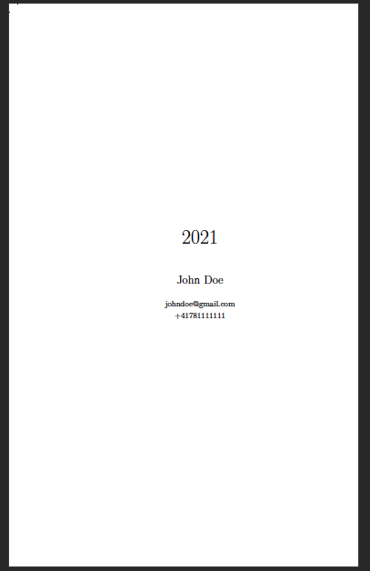
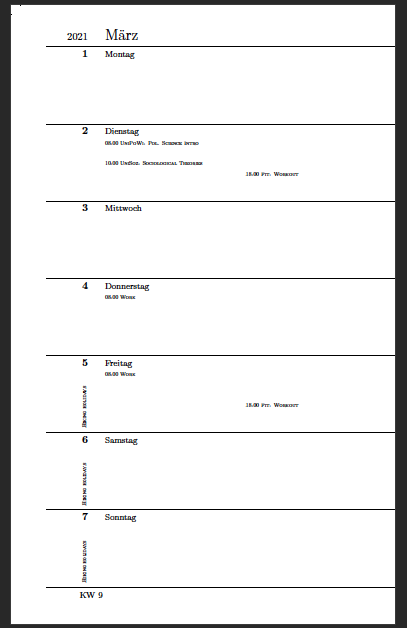
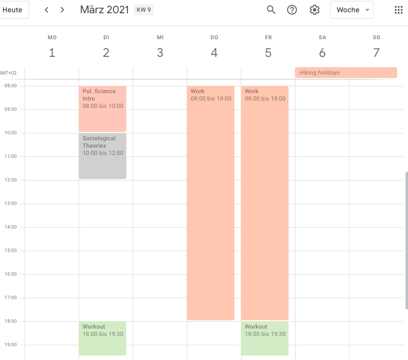

# Papierkalender

Generates a printable 12-month weekly planer, filled with events from a Google calendar.

The script generates either a LaTex or PDF file with a paper size of 13x20cm, which can be printed through a book printing service. The templates are inspired by the
Moleskine/Leuchtturm weekly planners. 

Some notes on the rendering of events: 
- Only the start time of events are rendered
- Full day events get rendered on the side of the day, rotated by 90 degrees
- Events are prefixed with the name of the Google calendar, except for the main calendar
- A title page is rendered at the beginning
- Language: German is hardcoded (month- & daynames). This can be changed in the Latex template and through setting another locale for the Python environment.

Example:





## Usage 

1. Python must be installed. It is recommended to create a new Python environment. I use Conda with Python 3.9.
2. Install the necessary Python packages:
   ```
   > pip install --upgrade google-api-python-client google-auth-httplib2 google-auth-oauthlib click jinja2
   ```
3. Create a Google Cloud project ([](https://console.developers.google.com/)) and save the `credentials.json` in the local directory. More on this can be found [here](https://karenapp.io/articles/how-to-automate-google-calendar-with-python-using-the-calendar-api/). 
4. Run the script in a terminal:

```
> python main.py 2021 2021.pdf "John\ Doe" johndoe@gmail.com +41781111111
```

5. Submit the PDF to a book printing service to get a physical archive of your digital calendar (you might have to adopt the sizes of the LaTex template in the code).

## Todos

- Localize the script (currently de_CH is hardcoded)
- Make paper size dynamic
- Make month label prettier for overlapping months (eg. "Februar/März")

## Credits

The script is based on two sources:

- The [LaTeX calendar layout](https://tex.stackexchange.com/questions/332735/latex-calendar-layout-in-moleskine-leuchtturm-weekly-format) in Moleskine/Leuchtturm weekly format on Stackoverflow by [ebosy](https://tex.stackexchange.com/users/64454/ebosi)
- This Python [script](https://gist.github.com/goerz/d0e1a28be8f322bf7bad3e9b8672bc67) by [Michael Goerz](https://michaelgoerz.net/notes/goodnotes-calendar-and-agenda-templates.html)

## Author

https://github.com/nomaad


